# **Configuring SSL with SSLforFree / Let's Encrypt**

## **Partner Engineering**

   
 
 
 

John Park  
Principal Solution Architect  
john.park@qlik.com

**Version: 1.2**  
**Initial Release Date: 7-May-20**
**Revisions** | **Notes** | **Date** | **Version**
------------------ | ----------- | --------- | -----------
Initial Draft | 20-May-2020 | John Park | 0.1 |
Release Draft | 21-May-2021 | John Park | 1.0 |

# Table of Contents

---

[**Summary**](#summary)

[**Part 1 - Checklist - PreConfiguration**](#part-1)

[**Part 2 - Create Certificate**](#part-2)

[**Part 3 - Import Certificate**](#part-3)

[**Part 4 - Remove Conflicts**](#part-4)

[**Part 5 - Configure Proxy**](#part-5)

[**Part 6 - Verification**](#part-6)

[**Part 7 - Additional Information**](#part-7)

## **Summary**

This document was created to help create SSL certificates for Qlik and allow HTTPS to work with Qlik Sense Server

HTTP connections are unsecure and from security sense is worst option for a external webserver deployment. A CA (Certificate Authority) called Let's Encrypt will issue free 90 day certificates and this guide will step you through setting up your Qlik Sense Server with Certificate from Let's Encrypt.

Also without proper Certificate and Qlik Mobile / Many of the SAML services will not work properly.

These are reference sites you can look at as suppliment to this site.

- [Let'sEncrypt.org](https://letsencrypt.org/)
- [CertBot for Automation for FreeSSL](https://certbot.eff.org/)
- [SSLforFree/ZeroSSL Site used to create 90 day free SSL using Let's Encrypt Authority](https://www.sslforfree.com/)
- [Qlik's help site](https://help.qlik.com/en-US/sense)
- [How To Create a PFX Cerfiticate: Qlik Sense Requires a PFX Certificate](https://www.ssl.com/how-to/create-a-pfx-p12-certificate-file-using-openssl/)
- [Great Article from Qlik Developer Ptarmigan Labs](https://ptarmiganlabs.com/blog/2017/10/01/free-ssl-certificates-for-qlik-sense/)
- [Qlik Community: Using DigiCert to Generate and Load Qlik Sense Certificates](https://community.qlik.com/t5/Qlik-Sense-Documents-Videos/Generating-Certificate-Signing-Requests-for-Trusted-Certificates/ta-p/1485241?attachment-id=140866) -[Qlik Community: Qlik Sense on AWS - Agastin Devaraj](https://community.qlik.com/t5/Technology-Partners-Ecosystem-Documents/Qlik-Sense-on-AWS-Deployment-Guide/ta-p/1550371?attachment-id=161431)
- [Qlik Community: Qlik Sense on AWS Deployment June 2017 - Jesus Centenos](https://community.qlik.com/t5/Qlik-Sense-Documents-Videos/NEW-June2017-Qlik-Sense-on-AWS-Deployment-Guide/ta-p/1495351?_ga=2.51544809.1747120527.1589997368-1011739496.1577464420&attachment-id=141471)

### Environment

- Test Domain - test.johnpark.io
- Version - Qlik Sense Feburary 2020
- OS - Windowd 2016 Server Data Center

## **Part 1**

### Checklist - PreConfiguration

1. Make sure Qlik Sense is working and all functionality is checked on the server.
2. You should have full control over a domain or subdomain.
3. Your server should have port 80 and 443 exposed to outside.
4. Admin privilages to install IIS on Windows.
5. Admin privilages to configure and work with Certificates.
6. Remote Desktop Privilages.
7. Permission to Change Settings on Server.

**_Before you start backup your server (Certificates, Settings, Configurations)._**  
**Point Domain from (Google, GoDaddy, etc to server IP)**  
**_At this point nothing will work !!!!_**

Turn Windows Firewall / Other Firewall Off or allow it to accept 80/443 coonections

Directions to turn firewall off <https://www.faqforge.com/windows-server-2016/turn-off-firewall-windows-server-2016/>

Go to QMC and enable proxy to handle HTTP and HTTPS port (80 and 443) under proxy setting.

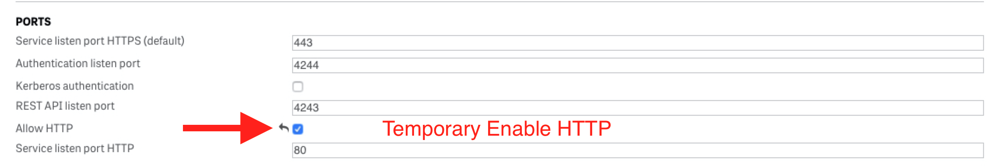

Go to QMC and whitelist correct Host/IP/Machine Names.  
In our example we are using AWS Server.

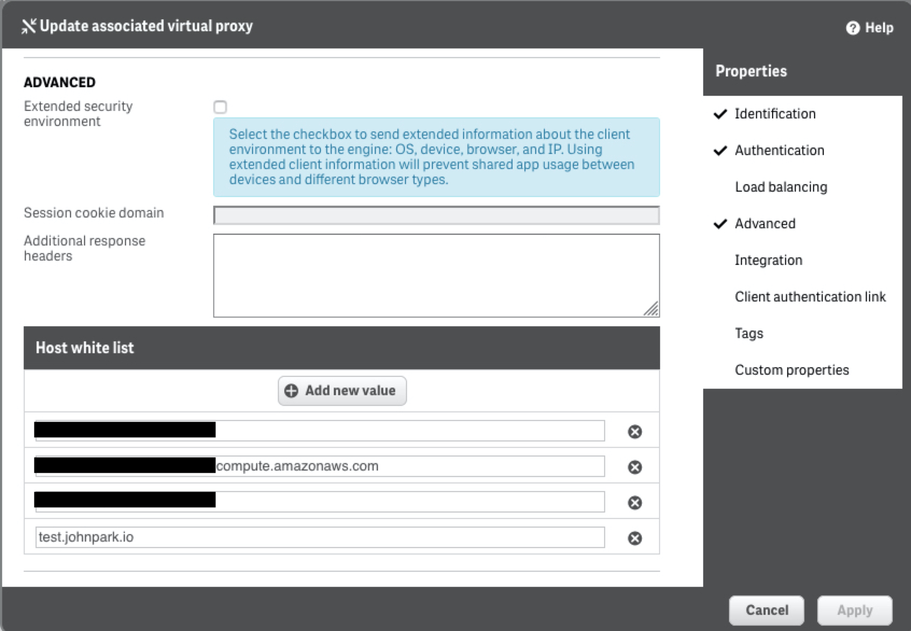

#### At This point you should be able to access your Qlik Sense server from Public domain using http protocol.(If you cannot access server from public domain stop here and ask for help)

## Now if you try to get into HTTPS protocol you should see following

Warning sign saying your site Certificate is different than others  

This is normal behavior since Qlik is not an CA and will issue selfsigned certificates
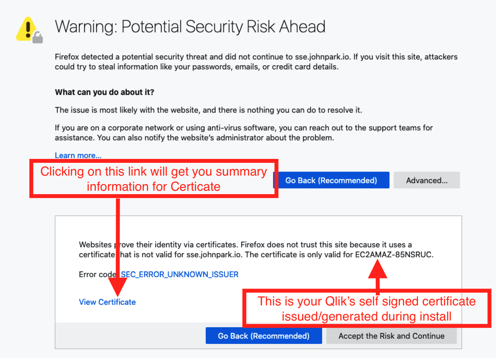

- Please note we are getting this error because domain name used to access this https site is not same as domain name certificate was issued for.
- Qlik Sense is setup to use default certificate which is different than our domain name.  
  If you want to learn more aobut wonderful world of certificates and security please google. HTTPS is more secure and encrypted and will not work with proper certificate issued by CA(Certificate Authority). Next step we will manipulate the server and get proper certificate installed.

## **Part 2**

### Create Cerfiticate

For Let's Encrypt CA(Certificate Authority) to issue you certificate you have to prove to them you have complete control over certificate. The flow of how Certificates and CA work together is documented well here - <https://www.ssl.com/faqs/what-is-a-certificate-authority/>

There are options to get certificate.

1. Pay companies like Symantec(Verisign), GoDaddy, DigiCert to issue you out a paid certificate.
2. Use Let'Encrypt - Free Certificate via validation.

For this document we will Option2 since Option1 and 2 are similar in most stepsa and Option 2 will allow all developers to test SSL for 90 Days free (Please note Let's Encrypt forced you to Revalidate every 90 days)

There are many implementation of Let's Encrypt
For this documentation we will use [SSlforFree](https://www.sslforfree.com/).  
We will discuss implementing Let'Encrypt or CertBot in later documents.

On your server stop Qlik Services(You need to only stop Proxy but I suggest stopping everything)

## Install IIS

- Open Server Manager and click Manage > Add Roles and Features. Click Next.
- Select Role-based or feature-based installation and click Next.
- Select the appropriate server. The local server is selected by default. Click Next.
- Enable Web Server (IIS) and click Next.
- No additional features are necessary to install the Web Adaptor, so click Next.
- On the Web Server Role (IIS) dialog box, click Next.
- On the Select role services dialog box, verify that the web server components listed below are enabled. Click Next.
- Verify that your settings are correct and click Install.
- When the installation completes, click Close to exit the wizard.

## Bind Your Domain port 80 via IIS

- Open IIS Manager via Control Panel->Systems and Security->Administrative Tools

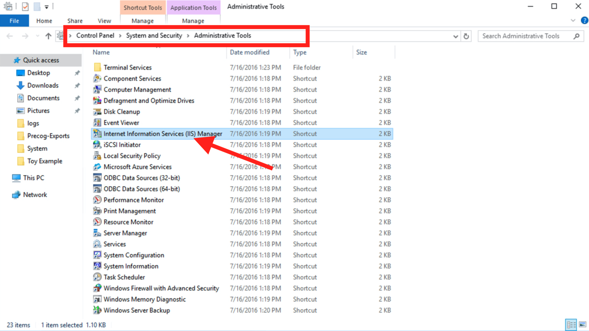

- Inspect the IIS Website

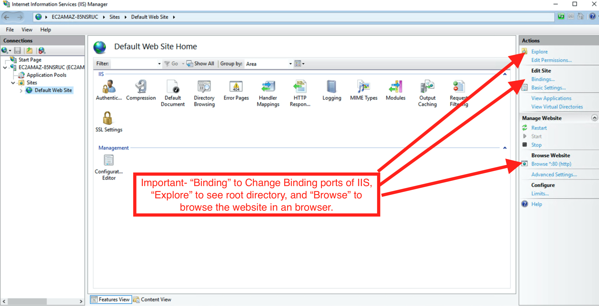

- Access Bindings and change your Domain

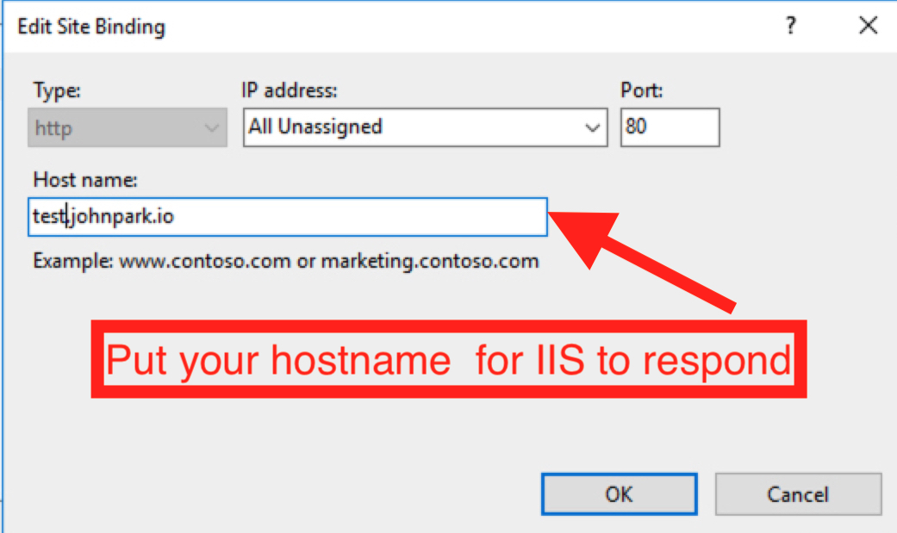

- Now Access http version of your site adn IIS splash menu will show

You can validate by clicking on "Browse" on IIS menu as well accessing domain from local host outside your server.
Once done you should see default IIS website
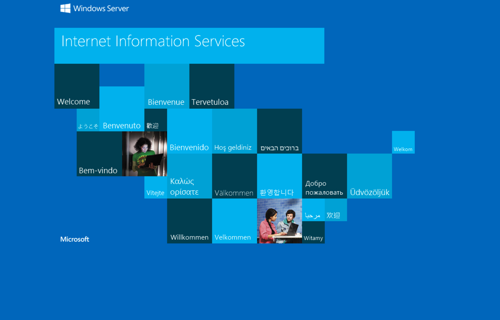

## Register Domain on SSLforFree.com/ZeroSSL

- Navigate your browser to https://www.sslforfree.com/ (Easier done from Server)
- "Create Free SSL Certificate" Box type your domain

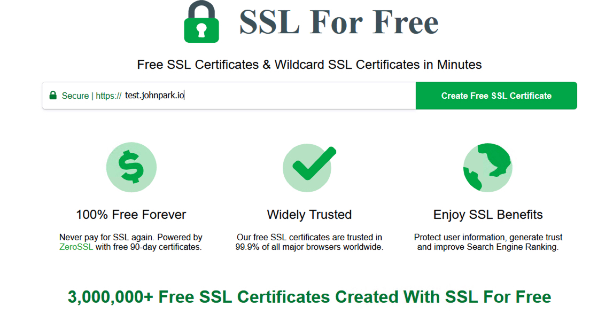

- Follow directions on SSLforFree and use HTTP File Upload.

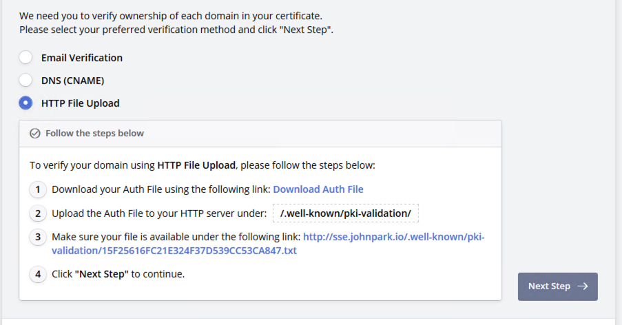

_You will need to register as the owner for Certificate_

- Using IIS manager click "Browse" to go to root folder and create the path and upload the file
  (Note: on Windows to create a folder with "." you must type "." at end of the name if ".well-known" you need to type ".well-known.")

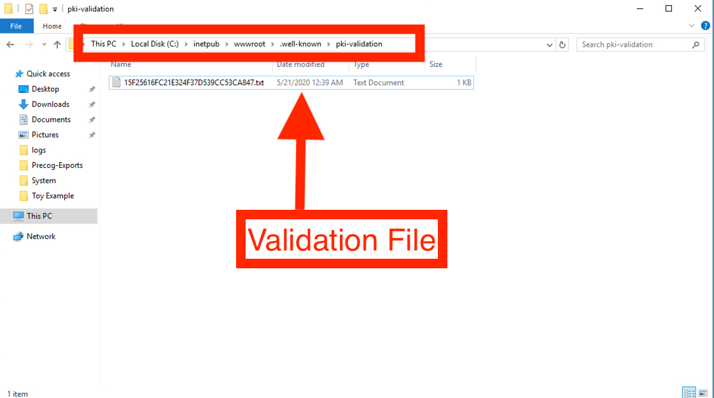

_Download the Validation file generated by SSLforFree and place in directory
Create the path needed by SSLforFree and place file._

- Now you validate the path with automated system and it validate and prepare Certificate.
  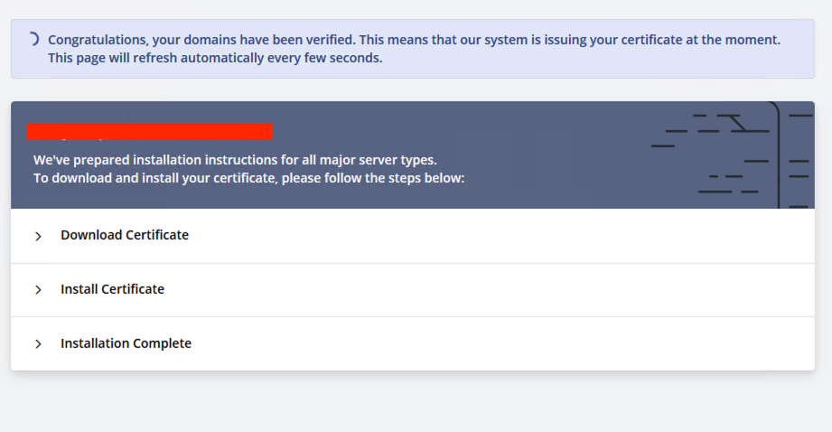

- Save the Certificate on the server.

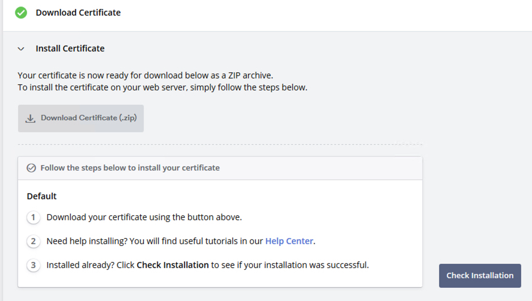

- ## Now you have your Certificate !!!

It Should be a zip file with CA Bundle, Certificate, and Private Key

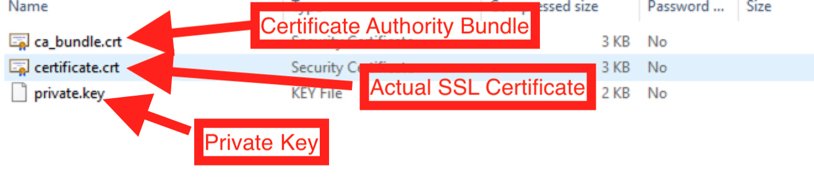

Stop IIS Website by removing Binding and Deleting Site. In Win2016 Server Service names are _Windows Process Activation Service and the World Wide Web Publishing Service_. Make sure in Services place those services in manual mode or processes will auto start during reboot.
**_(Personal Preference is removing IIS)_**

You can start Qlik Sense Server Processes again.

## **Part 3**

### Import Certificates

Using OpenSSL we need to combine the SSL Certificate and Private Key to creat a single PFX certificate.

We will use Win64OpenSSL_Light1_1_1g for this. You can download it from [Shining Light Production](http://slproweb.com/products/Win32OpenSSL.html)

Here are some OpenSSL webiste I used to reference the command from for those who are interested.

- https://www.ssl.com/how-to/create-a-pfx-p12-certificate-file-using-openssl/
- https://www.sslshopper.com/article-most-common-openssl-commands.html
- https://www.openssl.org/blog/

Install Win64OpenSSL application.  
Go to Start and run Win64 Open SSL Command Prompt traverse to directory of you certificate bundle from SSLforFree.

Run the following command  
`openssl pkcs12 -export -out new_certificate.pfx -inkey private.key -in certificate.crt`

_Note Please note the Certificate Password since you will need it during import into certificate store_

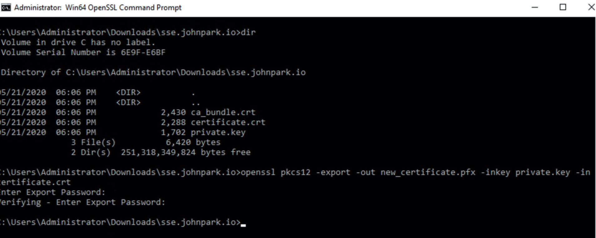

You will see a new "new_certificate.pfx" file created

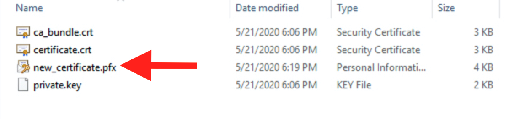

### Import the Certificate to Windows Server: (Please See Reference Document for more information)

1. Click Start > type MMC > Right Click > Run as Administrator
2. Click File > Add / Remove Snap In
3. Click Certificates > Click Add > choose My User Account
4. Click Certificates > Add > choose Computer Account > choose Local Computer  
   

5. Save MMC Setting to Desktop for Reference
6. Navigate to each folder listed below and import the customer provided certificate(note you are importing pfx file)

   - Provide the password you supplied during OpenSSL Command
   - _Tip: If you make keys as Exportable you can transfer keys during server migration_
   - Certificates (Local Computer) > Trusted Root Certification Authorities > Certificates
   - Certificates (Local Computer) > Personal > Certificates  
     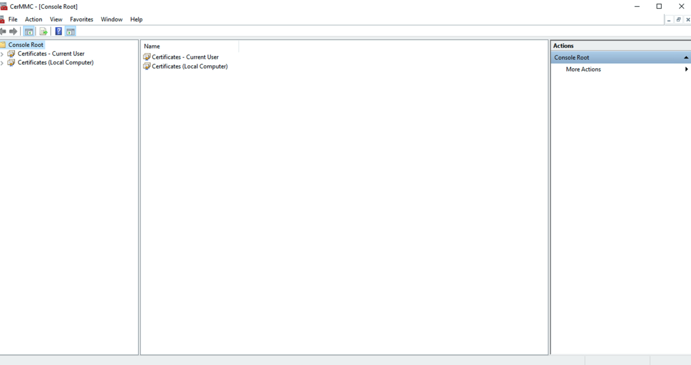

7. Verify Certification Import by looking at Domain as well as CA name. (In our case our CA was ZeroSSL)
   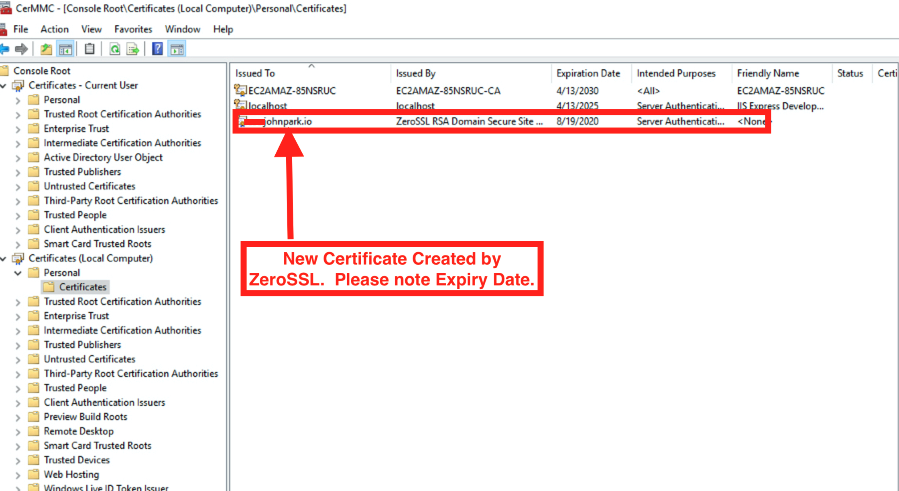
8. View Certificate Thumbprint by navigating to the Details tab and copy the Thumbprint value. Make sure to copy all leading and trailing spaces\*
   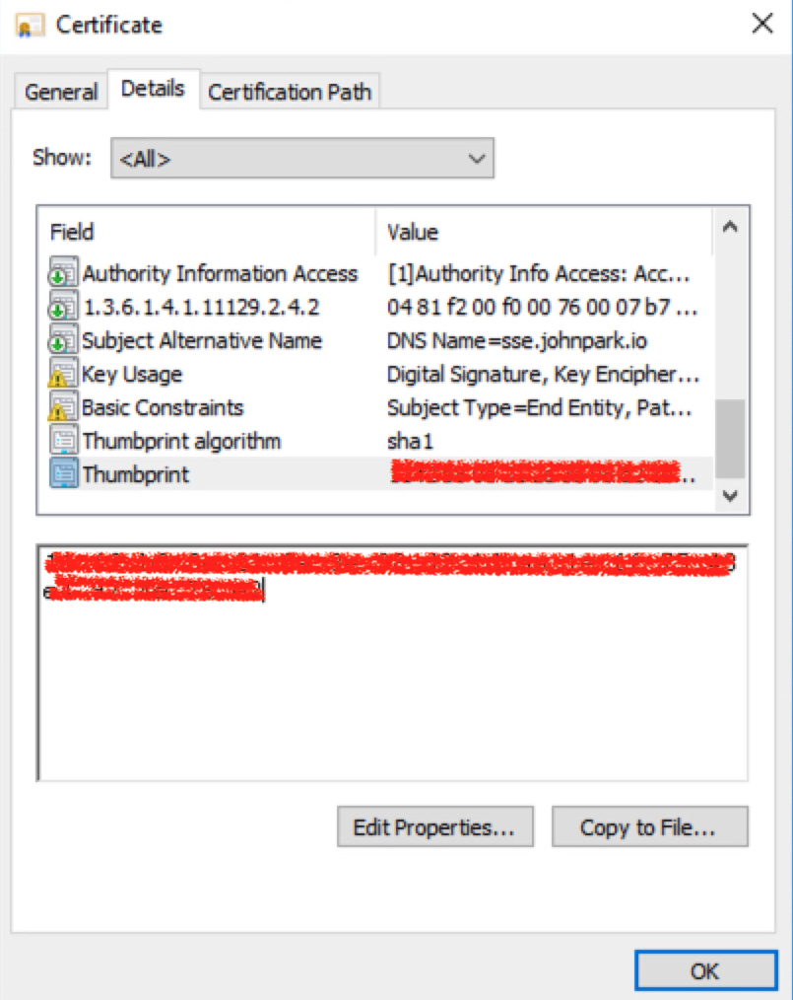

### Import the Thumbprint to QMC

1. Open QMC > Proxies > Central Proxy > Edit
2. On the right-hand side of the screen, click Security to enable additional
   properties.
3. Paste the browser thumbprint, including all spaces.
   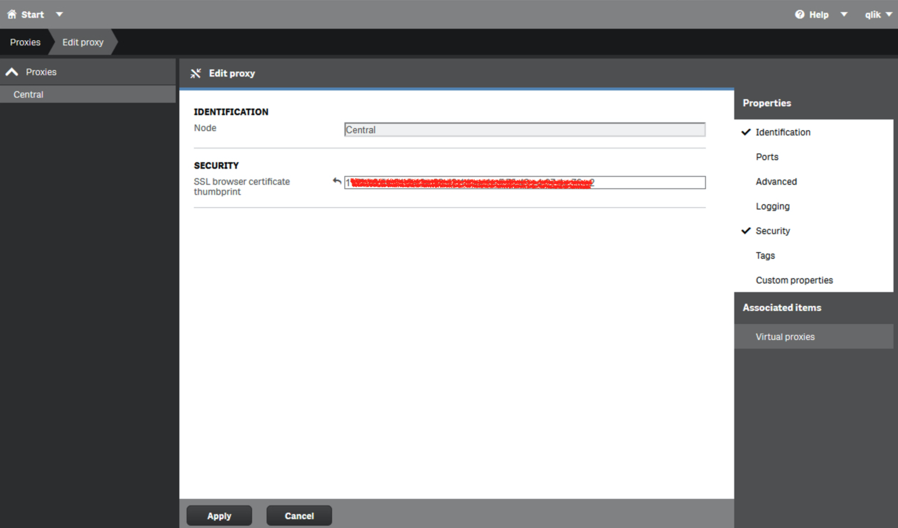
4. Click Apply to restart the Proxy.

## **Part 4**

### Remove Conflicts

`This section will be updated in future when setting up Microservice Architecture`

## **Part 5**

### Configure Proxy

`This section will be updated using a Proxy of API Gateway /Management Service`

## **Part 6**

### Verification

1. Refresh Browser
2. Validate by going to **_https_** port of shtesite from local server browser and external machine using different browser.
3. The error message should disappear as well you should see that Qlik sense uses Secure Connection.  
   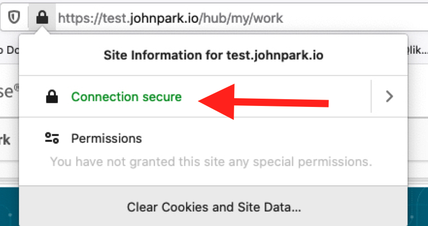

_Note - Using Safari Browser and Ipad/Iphone make sure the secure site is accessible due to stringent SSL built into Safari Browser. This may be required for Mobile Apps_

4. At this point you may go to proxy and shut off **_http_** port access making your Qlik Sense Server Secure.(All Transmissions are encrypted)

## **Part 7**

### Additional Information

If you would like additional information about this document please reach out John.Park@qlik.com or Michael.Robershaw@qlik.com

Note Certificates can get messy so please back up often and document carefully.

Othen Information can be found in [Qlik Community Technology Partners](https://community.qlik.com/t5/Technology-Partners-Ecosystem/ct-p/qlik-ecosystem "Qlik Technology Partner Eco System") in Technology Partner Sections where users can post questions and get them answered
